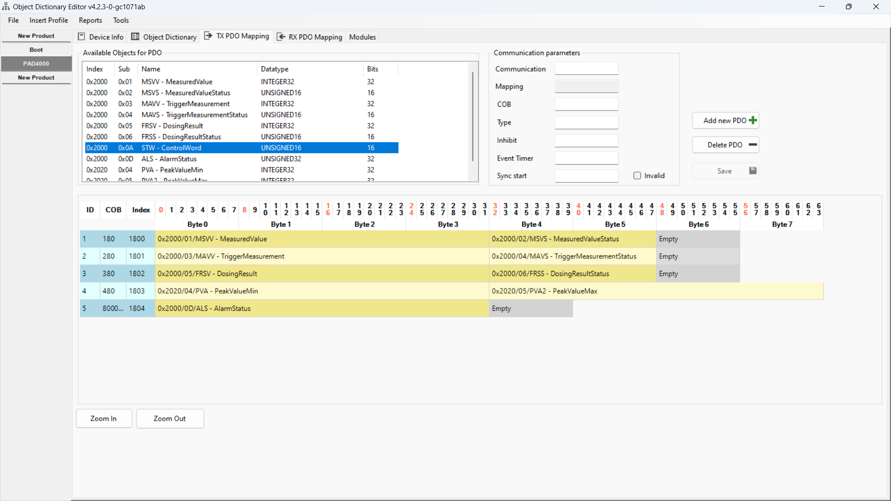
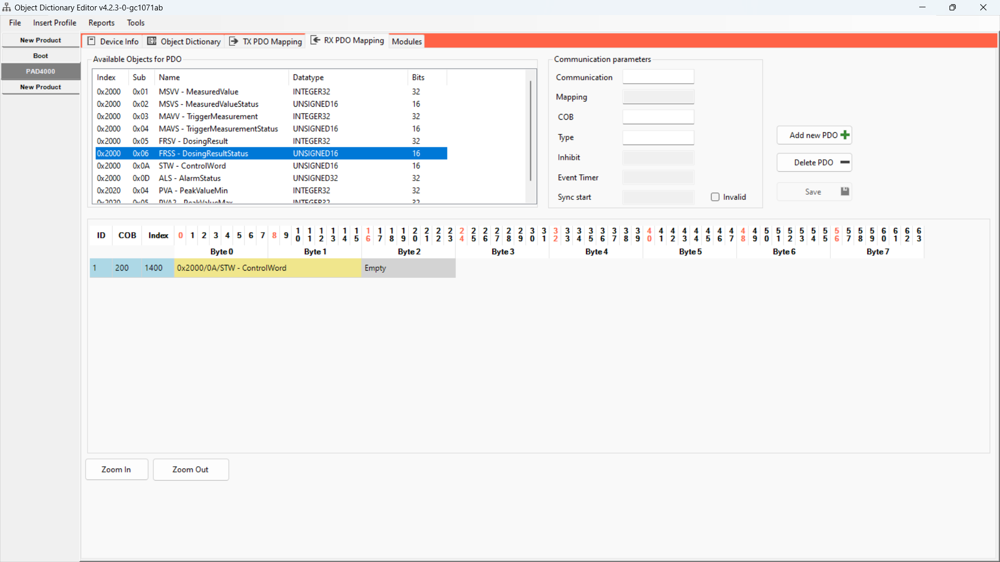
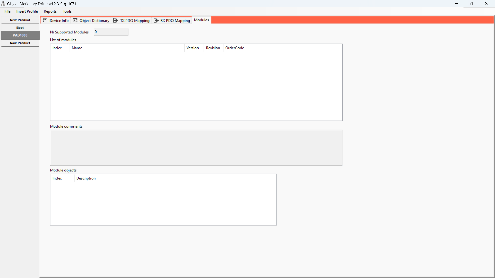
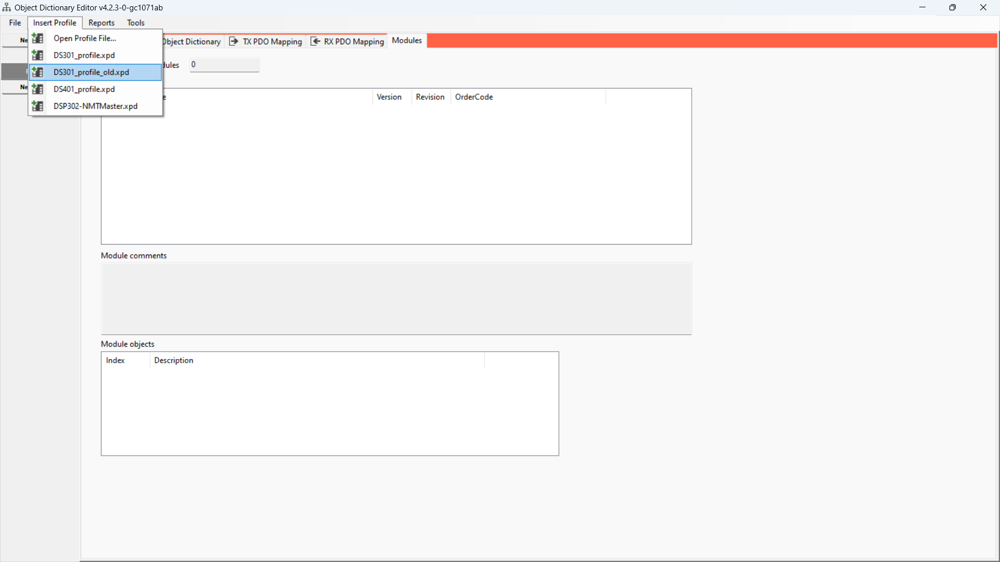

GUI
=============
* Open multiple devices
* Open EDS/DCF/XDC files
* Save EDS/DCF/XDC files
* View OD Entries and explore the Object Dictionary
* Add new OD entries
* Delete exisiting OD entries
* Create new Devices
* Add default profiles
* Create profiles that can be added to any project (just save the device xml file to the profiles/ directory, only include the minimum number of objects that you want to auto insert); This will auto add to insert menu
* Edit Device and File Info sections
* Set RX/TX PDO mappings easily from dropdown lists of available objects
* Add and remove new PDO entries (communication paramaters and mapping) with a single button's push
* Save groups of EDS/XML files as a network object with ability to set concrete node IDs
* View report of all configured PDOs across the network
* View modules and module details present within EDS files
* View/edit actual object values for device configuring/DCF files
* Support for loading XDD files (CanOpen offical XML)
* Support for saving XDD files (CanOpen offical XML)
* Some module info is displayed in GUI showing available modules (eds) and configured modules (dcf) and what OD entries they reference.
  Full details such as subobj extension and fixed subobj are not currently displayed and unless there is demand probably will not ever be.

[Available formats' list can be found here](https://github.com/CANopenNode/CANopenEditor?tab=readme-ov-file#available-formats).

Pictures
-------------
For those pictures, the file shown is: https://www.hbm.com/fileadmin/mediapool/support/download/weighing/pad/PAD4000_P80_113_01_COS.EDS

### General informations

### OD manipulation

### PDO manipulation
TPDO: 

RPDO: 

PDO editing: 

### Modules

### Profiles
Available profiles: 

Applying a profile: 

